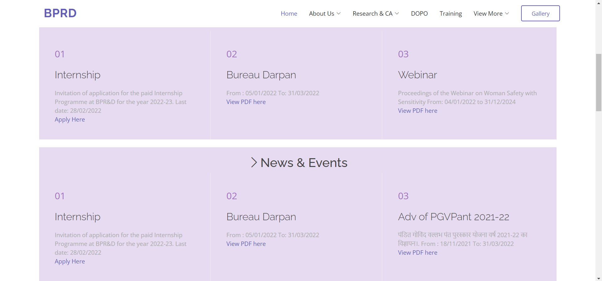
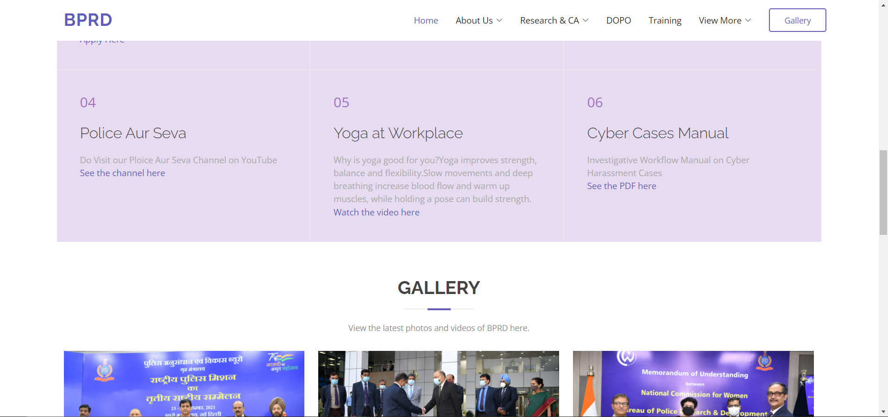
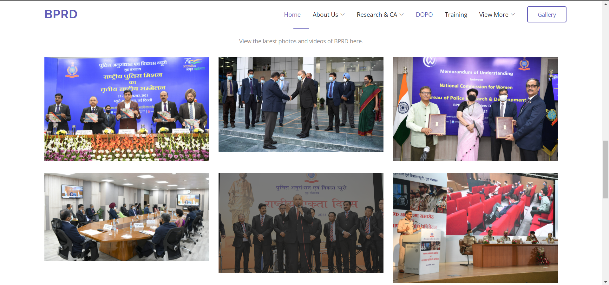
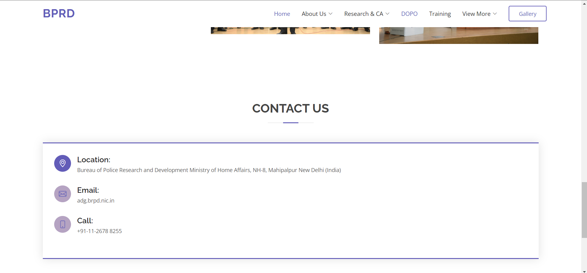
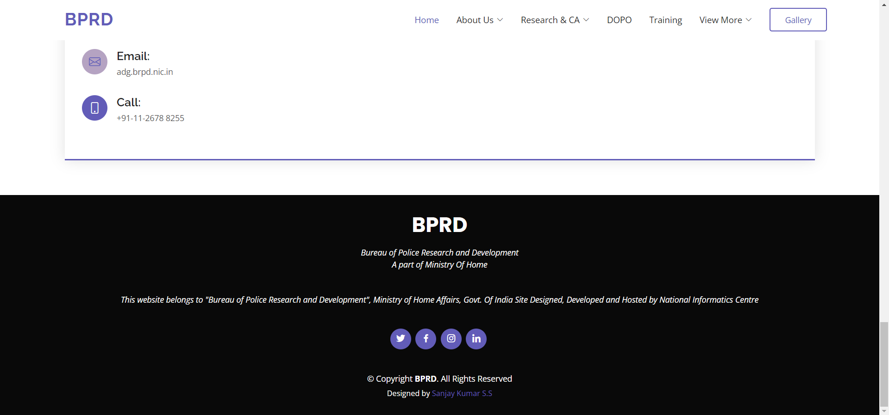
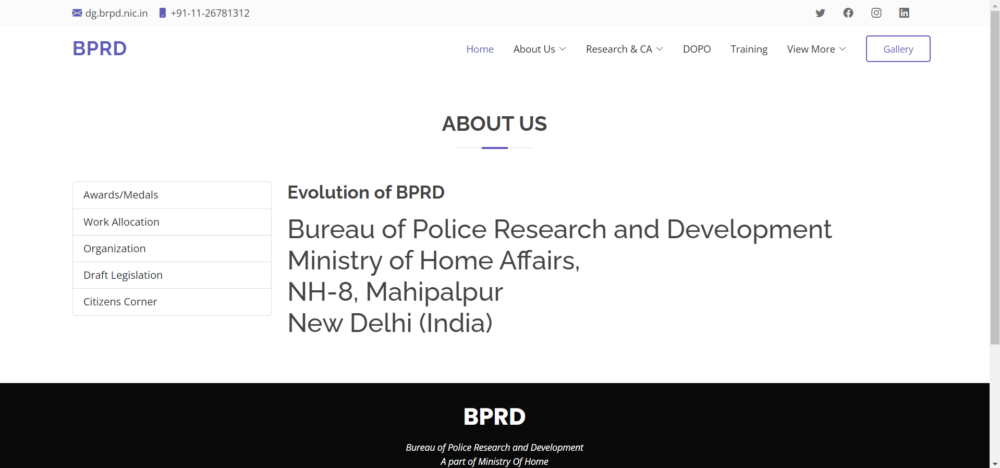
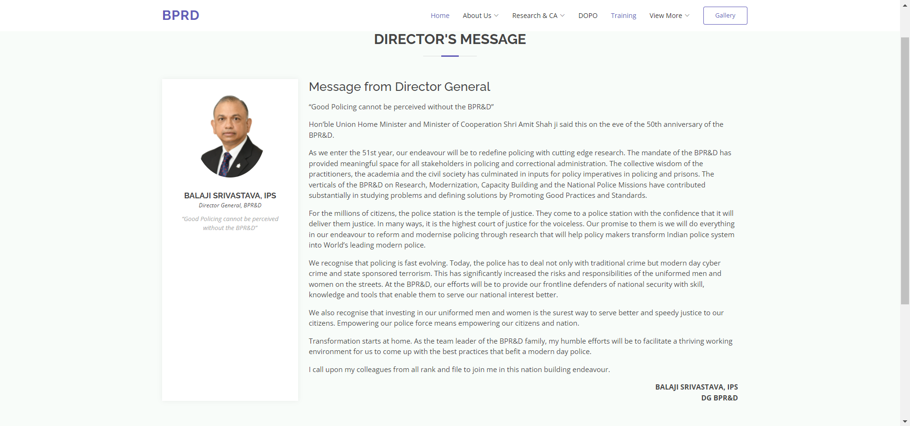

# Web Design using Bootstrap Framework

## AIM:
To design a website using bootstrap framework.

## DESIGN STEPS:

### Step 1:

Requirement collection.

### Step 2:

Creating the layout using bootstrap grid system.

### Step 3:

Updating the sample content.

### Step 4:

Choose the appropriate style and color scheme.

### Step 5:

Validate the layout in various browsers.

### Step 6:

Validate the HTML code.

### Step 6:

Publish the website in the given URL.

## PROGRAM :
### Home Page:
```
<!DOCTYPE html>
<html lang="en">

<head>
  <meta charset="utf-8">
  <meta content="width=device-width, initial-scale=1.0" name="viewport">
  <title>BPRD-Website</title>
  <!-- Favicons -->
  <link href="./img/bprd.png" rel="icon">

  <!-- Google Fonts -->
  <link href="https://fonts.googleapis.com/css?family=Open+Sans:300,300i,400,400i,600,600i,700,700i|Raleway:300,300i,400,400i,500,500i,600,600i,700,700i|Poppins:300,300i,400,400i,500,500i,600,600i,700,700i" rel="stylesheet">

  <!-- CSS File -->
  <link href="./vendor/bootstrap/css/bootstrap.min.css" rel="stylesheet">
  <link href="./vendor/bootstrap-icons/bootstrap-icons.css" rel="stylesheet">
  <link href="./vendor/boxicons/css/boxicons.min.css" rel="stylesheet">
  <link href="./vendor/glightbox/css/glightbox.min.css" rel="stylesheet">
  <link href="./vendor/swiper/swiper-bundle.min.css" rel="stylesheet">
  <link href="./css/style.css" rel="stylesheet">
</head>

<body>

  <!-- ======= Top Bar ======= -->
  <section id="topbar" class="d-flex align-items-center">
    <div class="container d-flex justify-content-center justify-content-md-between">
      <div class="contact-info d-flex align-items-center">
        <i class="bi bi-envelope-fill"></i><a href="mailto:dg.brpd.nic.in">adg.brpd.nic.in</a>
        <i class="bi bi-phone-fill phone-icon"></i>+91-11-2678 8255
      </div>
      <div class="social-links d-none d-md-block">
        <a href="#" class="twitter"><i class="bi bi-twitter"></i></a>
        <a href="#" class="facebook"><i class="bi bi-facebook"></i></a>
        <a href="#" class="instagram"><i class="bi bi-instagram"></i></a>
        <a href="#" class="linkedin"><i class="bi bi-linkedin"></i></i></a>
      </div>
    </div>
  </section>

  <!-- ======= Header ======= -->
  <header id="header" class="d-flex align-items-center">
    <div class="container d-flex align-items-center">
      <a href="index.html" class="logo me-auto"></a>
      <h1 class="logo me-auto" style="padding-right: 490px;"><a href="index.html">BPRD</a></h1>
      <nav id="navbar" class="navbar">
        <ul>
          <li><a class="nav-link scrollto active" href="./index.html">Home</a></li>
          <li class="dropdown"><a href="./aboutus.html"><span>About Us</span> <i class="bi bi-chevron-down"></i></a>
            <ul>
              <li><a href="./aboutus.html">Evolution of BPRD</a></li>
              <li><a href="#">Awards/Medals</a></li>
              <li><a href="#">Work Allocation</a></li>
              <li class="dropdown"><a href="#"><span>View More</span> <i class="bi bi-chevron-right"></i></a>
                <ul>
                  <li><a href="#">Organization</a></li>
                  <li><a href="#">Draft Legislation</a></li>
                  <li><a href="#">Contact Us</a></li>
                  <li><a href="#">Citizen's Corner</a></li>
                </ul>
              </li>
            </ul>
            <li class="dropdown"><a href="#"><span>Research & CA</span> <i class="bi bi-chevron-down"></i></a>
          <li><a class="nav-link scrollto " href="./index.html#portfolio">DOPO</a></li>
          <li><a class="nav-link scrollto" href="#team">Training</a></li>
          <li class="dropdown"><a href="#"><span>View More</span> <i class="bi bi-chevron-down"></i></a>
            <ul>
              <li><a href="./director.html">Director's Message</a></li>
              <li><a href="#">SPC</a></li>
              <li><a href="#">Modernization</a></li>
              <li><a href="#">NPM</a></li>
              <li><a href="#">SPD</a></li>
              <li><a href="#">Admin</a></li>
              <li><a href="#">SP Conf. & Police Expo</a></li>
              <li><a href="#">Publication/ Reports</a></li>
              <li><a href="#">Contact</a></li>
            </ul>
          </li>
          <li><a class="getstarted scrollto" href="./index.html#contact">Gallery</a></li>
        </ul>
        <i class="bi bi-list mobile-nav-toggle"></i>
      </nav><!-- .navbar -->

    </div>
  </header><!-- End Header -->

  <!-- ======= Hero Section ======= -->
  <section id="hero" style="height: 65vh;">
         
  </section><!-- End Hero -->

  <main id="main">

    <section id="why-us" class="why-us" style="padding-top: 30px;">
      <div class="container" style="background-color: #e6dbf1; padding-top: 30px;" >

        <div class="row no-gutters">
          <h3 class="bi bi-laptop" style="text-align: center;">What's New</h3>
          <div class="col-lg-4 col-md-6 content-item">
            <span>01</span>
            <h4>Internship</h4>
            <p>Invitation of application for the paid Internship Programme at BPR&D for the year 2022-23. Last date: 28/02/2022</p>
            <p><a href="https://bprd.nic.in/WriteReadData/News/Internship.pdf">Apply Here</a></p>
          </div>

          <div class="col-lg-4 col-md-6 content-item">
            <span>02</span>
            <h4>Bureau Darpan</h4>
            <p>From : 05/01/2022 To: 31/03/2022</p>
            <p><a href="https://bprd.nic.in/WriteReadData/News/BureauDarpan.pdf">View PDF here</a></p>
          </div>

          <div class="col-lg-4 col-md-6 content-item">
            <span>03</span>
            <h4>Webinar</h4>
            <p>	Proceedings of the Webinar on Woman Safety with Sensitivity From: 04/01/2022 to 31/12/2024</p>
            <p><a href="https://bprd.nic.in/WriteReadData/News/Adv%20of%20PGVPant%202021-22.pdf">View PDF here</a></p>
          </div>
        </div>

      </div>
    </section><!-- End News & Events Section -->


    <!-- ======= News & Events Section ======= -->
    <section id="why-us" class="why-us" style="padding-top: 20px;">
      <div class="container" style="background-color: #e6dbf1;">

        <div class="row no-gutters">
          <h2 class="bi bi-chevron-right" style="text-align: center; padding-top: 20px;">News & Events</h2>
          <div class="col-lg-4 col-md-6 content-item">
            <span>01</span>
            <h4>Internship</h4>
            <p>Invitation of application for the paid Internship Programme at BPR&D for the year 2022-23. Last date: 28/02/2022</p>
            <p><a href="https://bprd.nic.in/WriteReadData/News/Internship.pdf">Apply Here</a></p>
          </div>

          <div class="col-lg-4 col-md-6 content-item">
            <span>02</span>
            <h4>Bureau Darpan</h4>
            <p>From : 05/01/2022 To: 31/03/2022</p>
            <p><a href="https://bprd.nic.in/WriteReadData/News/BureauDarpan.pdf">View PDF here</a></p>
          </div>

          <div class="col-lg-4 col-md-6 content-item">
            <span>03</span>
            <h4>Adv of PGVPant 2021-22</h4>
            <p>	पंडित गोविंद वल्लभ पंत पुरस्कार योजना वर्ष 2021-22 का विज्ञापन।. From : 18/11/2021 To: 31/03/2022</p>
            <p><a href="https://bprd.nic.in/WriteReadData/News/Adv%20of%20PGVPant%202021-22.pdf">View PDF here</a></p>
          </div>

          <div class="col-lg-4 col-md-6 content-item">
            <span>04</span>
            <h4>Police Aur Seva</h4>
            <p>Do Visit our Ploice Aur Seva Channel on YouTube</p>
            <p><a href="https://www.youtube.com/channel/UCGhrg_cnnGuhwXfCU16kYow/videos">See the channel here</a></p>
          </div>

          <div class="col-lg-4 col-md-6 content-item">
            <span>05</span>
            <h4>Yoga at Workplace</h4>
            <p>Why is yoga good for you?Yoga improves strength, balance and flexibility.Slow movements and deep breathing increase blood flow and warm up muscles, while holding a pose can build strength.</p>
            <p><a href="https://bprd.nic.in/WhatsNews_Description.aspx?News_id=10308">Watch the video here</a></p>
          </div>

          <div class="col-lg-4 col-md-6 content-item">
            <span>06</span>
            <h4>Cyber Cases Manual</h4>
            <p>Investigative Workflow Manual on Cyber Harassment Cases</p>
            <p><a href="https://bprd.nic.in/WriteReadData/News/BPRD%20Cyber%20harassment%20cases%206-3-21.pdf">See the PDF here</a></p>
          </div>

        </div>

      </div>
    </section><!-- End News & Events Section -->


    <!-- ======= Gallery Section ======= -->
    <section id="portfolio" class="portfolio">
      <div class="container">

        <div class="section-title">
          <h2>GALLERY</h2>
          <p>View the latest photos and videos of BPRD here.</p>
        </div>

        <div class="row portfolio-container">

          <div class="col-lg-4 col-md-6 portfolio-item filter-app">
            <div class="portfolio-wrap">
              
              
            </div>
          </div>

          <div class="col-lg-4 col-md-6 portfolio-item filter-app">
            <div class="portfolio-wrap">
              

            </div>
          </div>

          <div class="col-lg-4 col-md-6 portfolio-item filter-card">
            <div class="portfolio-wrap">
              

            </div>
          </div>

          <div class="col-lg-4 col-md-6 portfolio-item filter-app">
            <div class="portfolio-wrap">
              

            </div>
          </div>

          <div class="col-lg-4 col-md-6 portfolio-item filter-card">
            <div class="portfolio-wrap">
              

            </div>
          </div>

          <div class="col-lg-4 col-md-6 portfolio-item filter-app">
            <div class="portfolio-wrap">
              

            </div>
          </div>
        </div>
      </div>
    </section><!-- Gallery Section -->

  
    <!-- ======= Contact Section ======= -->
    <section id="contact" class="contact">
      <div class="container">

        <div class="section-title">
          <h2>Contact Us</h2>
        </div>

        <div class="row">

          <div class=" d-flex align-items-stretch">
            <div class="info">
              <div class="address">
                <i class="bi bi-geo-alt"></i>
                <h4>Location:</h4>
                <p>Bureau of Police Research and Development
                  Ministry of Home Affairs,
                  NH-8, Mahipalpur
                  New Delhi (India)</p>
              </div>

              <div class="email">
                <i class="bi bi-envelope"></i>
                <h4>Email:</h4>
                <p>adg.brpd.nic.in</p>                 
              </div>

              <div class="phone">
                <i class="bi bi-phone"></i>
                <h4>Call:</h4>
                <p>+91-11-2678 8255</p>
              </div>
            </div>

          </div>
        </div>

      </div>
    </section><!-- End Contact Section -->

  </main><!-- End #main -->

  <!-- ======= Footer ======= -->
  <footer id="footer">
    <div class="container">
      <h3>BPRD</h3>
      <p>Bureau of Police Research and Development <br> A part of Ministry Of Home</p>
      <p>This website belongs to "Bureau of Police Research and Development", Ministry of Home Affairs, Govt. Of India Site Designed, Developed and Hosted by National Informatics Centre</p>
      <div class="social-links">
        <a href="#" class="twitter"><i class="bx bxl-twitter"></i></a>
        <a href="#" class="facebook"><i class="bx bxl-facebook"></i></a>
        <a href="#" class="instagram"><i class="bx bxl-instagram"></i></a>
        <a href="#" class="linkedin"><i class="bx bxl-linkedin"></i></a>
      </div>
      <div class="copyright">
        &copy; Copyright <strong><span>BPRD</span></strong>. All Rights Reserved
      </div>
      <div class="credits">
        Designed by <a href="https://bootstrapmade.com/">Sanjay Kumar S.S</a>
      </div>
    </div>
  </footer><!-- End Footer -->

    <!-- Vendor JS Files -->
  <!-- Vendor JS Files -->
  <script src="assets/vendor/bootstrap/js/bootstrap.bundle.min.js"></script>
  <script src="assets/vendor/glightbox/js/glightbox.min.js"></script>
  <script src="assets/vendor/isotope-layout/isotope.pkgd.min.js"></script>
  <script src="assets/vendor/swiper/swiper-bundle.min.js"></script>
  <script src="assets/vendor/php-email-form/validate.js"></script>
  <!-- Template Main JS File -->
  <script src="./js/main.js"></script>
</body>
</html>
```
### About Us:
```
<!DOCTYPE html>
<html lang="en">

<head>
  <meta charset="utf-8">
  <meta content="width=device-width, initial-scale=1.0" name="viewport">
  <title>BPRD-Website</title>
  <!-- Favicons -->
  <link href="./img/bprd.png" rel="icon">

  <!-- Google Fonts -->
  <link href="https://fonts.googleapis.com/css?family=Open+Sans:300,300i,400,400i,600,600i,700,700i|Raleway:300,300i,400,400i,500,500i,600,600i,700,700i|Poppins:300,300i,400,400i,500,500i,600,600i,700,700i" rel="stylesheet">

  <!-- CSS File -->
  <link href="./vendor/bootstrap/css/bootstrap.min.css" rel="stylesheet">
  <link href="./vendor/bootstrap-icons/bootstrap-icons.css" rel="stylesheet">
  <link href="./vendor/boxicons/css/boxicons.min.css" rel="stylesheet">
  <link href="./vendor/glightbox/css/glightbox.min.css" rel="stylesheet">
  <link href="./vendor/swiper/swiper-bundle.min.css" rel="stylesheet">
  <link href="./css/style.css" rel="stylesheet">
</head>

<body>

  <!-- ======= Top Bar ======= -->
  <section id="topbar" class="d-flex align-items-center">
    <div class="container d-flex justify-content-center justify-content-md-between">
      <div class="contact-info d-flex align-items-center">
        <i class="bi bi-envelope-fill"></i><a href="mailto:dg.brpd.nic.in">dg.brpd.nic.in</a>
        <i class="bi bi-phone-fill phone-icon"></i>+91-11-26781312
      </div>
      <div class="social-links d-none d-md-block">
        <a href="#" class="twitter"><i class="bi bi-twitter"></i></a>
        <a href="#" class="facebook"><i class="bi bi-facebook"></i></a>
        <a href="#" class="instagram"><i class="bi bi-instagram"></i></a>
        <a href="#" class="linkedin"><i class="bi bi-linkedin"></i></i></a>
      </div>
    </div>
  </section>

<!-- ======= Header ======= -->
<header id="header" class="d-flex align-items-center">
  <div class="container d-flex align-items-center">
    <a href="index.html" class="logo me-auto"></a>
    <h1 class="logo me-auto" style="padding-right: 490px;"><a href="index.html">BPRD</a></h1>
    <nav id="navbar" class="navbar">
      <ul>
        <li><a class="nav-link scrollto active" href="./index.html">Home</a></li>
        <li class="dropdown"><a href="./aboutus.html"><span>About Us</span> <i class="bi bi-chevron-down"></i></a>
          <li class="dropdown"><a href="./spc.html"><span>Research & CA</span> <i class="bi bi-chevron-down"></i></a>
        <li><a class="nav-link scrollto " href="./index.html#portfolio">DOPO</a></li>
        <li><a class="nav-link scrollto" href="#team">Training</a></li>
        <li class="dropdown"><a href="#"><span>View More</span> <i class="bi bi-chevron-down"></i></a>
          <ul>
            <li><a href="#">SPC</a></li>
            <li><a href="#">Modernization</a></li>
            <li><a href="#">NPM</a></li>
            <li><a href="#">SPD</a></li>
            <li><a href="#">Admin</a></li>
            <li><a href="#">SP Conf. & Police Expo</a></li>
            <li><a href="#">Publication/ Reports</a></li>
            <li><a href="#">Contact</a></li>
          </ul>
        </li>
        <li><a class="getstarted scrollto" href="./index.html#contact">Gallery</a></li>
      </ul>
      <i class="bi bi-list mobile-nav-toggle"></i>
    </nav><!-- .navbar -->

  </div>
</header><!-- End Header -->
  
  <!-- ======= About Us Section ======= -->
<section id="about" class="about">
    <div class="container">

      <div class="section-title">
        <h2>About Us</h2>
      </div>

      <div class="row">
        <div class="col-lg-3 order-1 order-lg-1">
          <div class="list-group">
            <ul class="list-group">
              <li class="list-group-item">Awards/Medals</li>
              <li class="list-group-item">Work Allocation</li>
              <li class="list-group-item">Organization</li>
              <li class="list-group-item">Draft Legislation</li>
              <li class="list-group-item">Citizens Corner</li>
            </ul>
          </div>
        </div>
        <div class="col-lg-9 pt-4 pt-lg-0 order-2 order-lg-1 content">
          <h3>Evolution of BPRD</h3>
          <p class="fst-italic">
            <h1>
               Bureau of Police Research and Development
               Ministry of Home Affairs,<br/>
               NH-8, Mahipalpur<br/>
               New Delhi (India)
            </h1>   
          </p>
        </div>
      </div>
    </div>
  </section><!-- End About Us Section -->

  <!-- ======= Footer ======= -->
  <footer id="footer">
    <div class="container">
      <h3>BPRD</h3>
      <p>Bureau of Police Research and Development <br> A part of Ministry Of Home</p>
      <p>This website belongs to "Bureau of Police Research and Development", Ministry of Home Affairs, Govt. Of India Site Designed, Developed and Hosted by National Informatics Centre</p>
      <div class="social-links">
        <a href="#" class="twitter"><i class="bx bxl-twitter"></i></a>
        <a href="#" class="facebook"><i class="bx bxl-facebook"></i></a>
        <a href="#" class="instagram"><i class="bx bxl-instagram"></i></a>
        <a href="#" class="linkedin"><i class="bx bxl-linkedin"></i></a>
      </div>
      <div class="copyright">
        &copy; Copyright <strong><span>BPRD</span></strong>. All Rights Reserved
      </div>
      <div class="credits">
        Designed by <a href="https://bootstrapmade.com/">Sanjay Kumar S.S</a>
      </div>
    </div>
  </footer><!-- End Footer -->

  <!-- Template Main JS File -->
  <script src="./js/main.js"></script>
</body>
</html>
```
### Director's Message:
```
<!DOCTYPE html>
<html lang="en">

<head>
  <meta charset="utf-8">
  <meta content="width=device-width, initial-scale=1.0" name="viewport">
  <title>BPRD-Website</title>
  <!-- Favicons -->
  <link href="./img/bprd.png" rel="icon">

  <!-- Google Fonts -->
  <link href="https://fonts.googleapis.com/css?family=Open+Sans:300,300i,400,400i,600,600i,700,700i|Raleway:300,300i,400,400i,500,500i,600,600i,700,700i|Poppins:300,300i,400,400i,500,500i,600,600i,700,700i" rel="stylesheet">

  <!-- CSS File -->
  <link href="./vendor/bootstrap/css/bootstrap.min.css" rel="stylesheet">
  <link href="./vendor/bootstrap-icons/bootstrap-icons.css" rel="stylesheet">
  <link href="./vendor/boxicons/css/boxicons.min.css" rel="stylesheet">
  <link href="./vendor/glightbox/css/glightbox.min.css" rel="stylesheet">
  <link href="./vendor/swiper/swiper-bundle.min.css" rel="stylesheet">
  <link href="./css/style.css" rel="stylesheet">
</head>

<body>

  <!-- ======= Top Bar ======= -->
  <section id="topbar" class="d-flex align-items-center">
    <div class="container d-flex justify-content-center justify-content-md-between">
      <div class="contact-info d-flex align-items-center">
        <i class="bi bi-envelope-fill"></i><a href="mailto:dg.brpd.nic.in">dg.brpd.nic.in</a>
        <i class="bi bi-phone-fill phone-icon"></i>+91-11-26781312
      </div>
      <div class="social-links d-none d-md-block">
        <a href="#" class="twitter"><i class="bi bi-twitter"></i></a>
        <a href="#" class="facebook"><i class="bi bi-facebook"></i></a>
        <a href="#" class="instagram"><i class="bi bi-instagram"></i></a>
        <a href="#" class="linkedin"><i class="bi bi-linkedin"></i></i></a>
      </div>
    </div>
  </section>

  <!-- ======= Header ======= -->
  <header id="header" class="d-flex align-items-center">
    <div class="container d-flex align-items-center">
      <a href="index.html" class="logo me-auto"></a>
      <h1 class="logo me-auto" style="padding-right: 490px;"><a href="index.html">BPRD</a></h1>
      <nav id="navbar" class="navbar">
        <ul>
          <li><a class="nav-link scrollto active" href="./index.html">Home</a></li>
          <li class="dropdown"><a href="./aboutus.html"><span>About Us</span> <i class="bi bi-chevron-down"></i></a>
            <ul>
              <li><a href="./aboutus.html">Evolution of BPRD</a></li>
              <li><a href="#">Awards/Medals</a></li>
              <li><a href="#">Work Allocation</a></li>
              <li class="dropdown"><a href="#"><span>View More</span> <i class="bi bi-chevron-right"></i></a>
                <ul>
                  <li><a href="#">Organization</a></li>
                  <li><a href="#">Draft Legislation</a></li>
                  <li><a href="#">Contact Us</a></li>
                  <li><a href="#">Citizen's Corner</a></li>
                </ul>
              </li>
            </ul>
            <li class="dropdown"><a href="#"><span>Research & CA</span> <i class="bi bi-chevron-down"></i></a>
          <li><a class="nav-link scrollto " href="./index.html#portfolio">DOPO</a></li>
          <li><a class="nav-link scrollto" href="#team">Training</a></li>
          <li class="dropdown"><a href="#"><span>View More</span> <i class="bi bi-chevron-down"></i></a>
            <ul>
              <li><a href="./director.html">Director's Message</a></li>
              <li><a href="#">SPC</a></li>
              <li><a href="#">Modernization</a></li>
              <li><a href="#">NPM</a></li>
              <li><a href="#">SPD</a></li>
              <li><a href="#">Admin</a></li>
              <li><a href="#">SP Conf. & Police Expo</a></li>
              <li><a href="#">Publication/ Reports</a></li>
              <li><a href="#">Contact</a></li>
            </ul>
          </li>
          <li><a class="getstarted scrollto" href="./index.html#contact">Gallery</a></li>
        </ul>
        <i class="bi bi-list mobile-nav-toggle"></i>
      </nav><!-- .navbar -->

    </div>
  </header><!-- End Header -->


    </div>
  </header><!-- End Header -->
  <section id="team" class="team section-bg">
    <div class="container">

      <div class="section-title">
        <h2>Director's Message</h2>
      </div>

      <div class="row">

        <div class="col-lg-3 col-md-6 d-flex align-items-stretch">
          <div class="member">
            
            <h4>BALAJI SRIVASTAVA, IPS</h4>
            <span> Director General, BPR&D</span>
            <p>
              “Good Policing cannot be perceived without the BPR&D” 
            </p>
          </div>
        </div>

        <div class="col-lg-9 pt-4 pt-lg-0 order-2 order-lg-1 content">
          <h3>Message from Director General</h3>
          <p class="fst-italic">
                <p>“Good Policing cannot be perceived without the BPR&D” </p>
                <p>Hon’ble Union Home Minister and Minister of Cooperation Shri Amit Shah ji said this on the eve of the 50th anniversary of the BPR&D.</p>
                <p>As we enter the 51st year, our endeavour will be to redefine policing with cutting edge research. The mandate of the BPR&D has provided meaningful space for all stakeholders in policing and correctional administration. The collective wisdom of the practitioners, the academia and the civil society has culminated in inputs for policy imperatives in policing and prisons. The verticals of the BPR&D on Research, Modernization, Capacity Building and the National Police Missions have contributed substantially in studying problems and defining solutions by Promoting Good Practices and Standards.</p>
                <p>For the millions of citizens, the police station is the temple of justice. They come to a police station with the confidence that it will deliver them justice. In many ways, it is the highest court of justice for the voiceless. Our promise to them is we will do everything in our endeavour to reform and modernise policing through research that will help policy makers transform Indian police system into World’s leading modern police.</p>
                <p>We recognise that policing is fast evolving. Today, the police has to deal not only with traditional crime but modern day cyber crime and state sponsored terrorism. This has significantly increased the risks and responsibilities of the uniformed men and women on the streets. At the BPR&D, our efforts will be to provide our frontline defenders of national security with skill, knowledge and tools that enable them to serve our national interest better.</p>  
                <p>We also recognise that investing in our uniformed men and women is the surest way to serve better and speedy justice to our citizens. Empowering our police force means empowering our citizens and nation.</p>  
                <p>Transformation starts at home. As the team leader of the BPR&D family, my humble efforts will be to facilitate a thriving working environment for us to come up with the best practices that befit a modern day police.</p>  
                <p> I call upon my colleagues from all rank and file to join me in this nation building endeavour.</p>
                <p style="text-align: right; font-weight: bold;">BALAJI SRIVASTAVA, IPS <br>DG BPR&D</p>
          </p>
        </div>
      </div>

    </div>
  </section>
  <!-- ======= Footer ======= -->
  <footer id="footer">
    <div class="container">
      <h3>BPRD</h3>
      <p>Bureau of Police Research and Development <br> A part of Ministry Of Home</p>
      <p>This website belongs to "Bureau of Police Research and Development", Ministry of Home Affairs, Govt. Of India Site Designed, Developed and Hosted by National Informatics Centre</p>
      <div class="social-links">
        <a href="#" class="twitter"><i class="bx bxl-twitter"></i></a>
        <a href="#" class="facebook"><i class="bx bxl-facebook"></i></a>
        <a href="#" class="instagram"><i class="bx bxl-instagram"></i></a>
        <a href="#" class="linkedin"><i class="bx bxl-linkedin"></i></a>
      </div>
      <div class="copyright">
        &copy; Copyright <strong><span>BPRD</span></strong>. All Rights Reserved
      </div>
      <div class="credits">
        Designed by <a href="https://bootstrapmade.com/">Sanjay Kumar S.S</a>
      </div>
    </div>
  </footer><!-- End Footer -->

  <!-- Template Main JS File -->
  <script src="./js/main.js"></script>
</body>
</html>
```

## OUTPUT:

### Home Page:






### About Us:


### Director's Message:

## Result:
Thus a website is designed using bootstrap framework.

